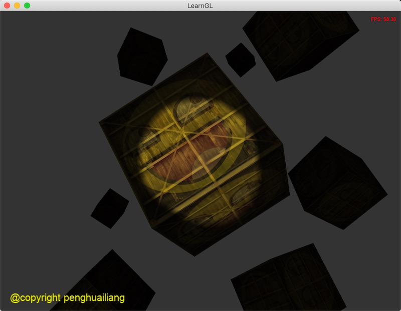
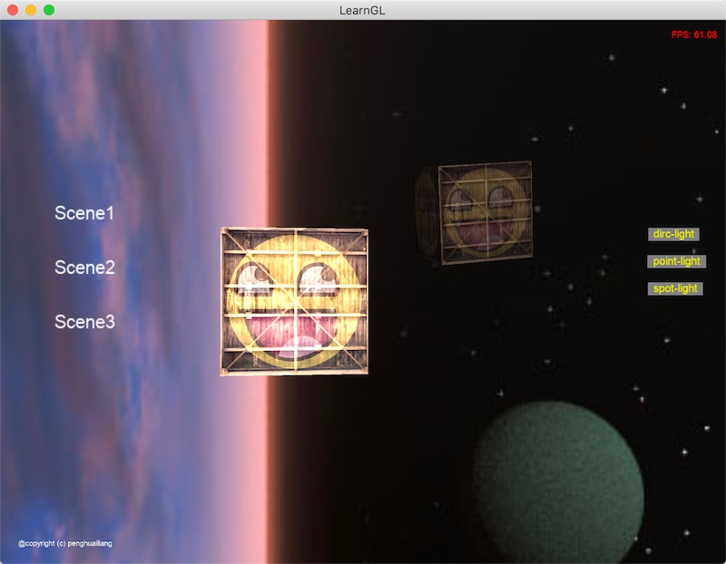
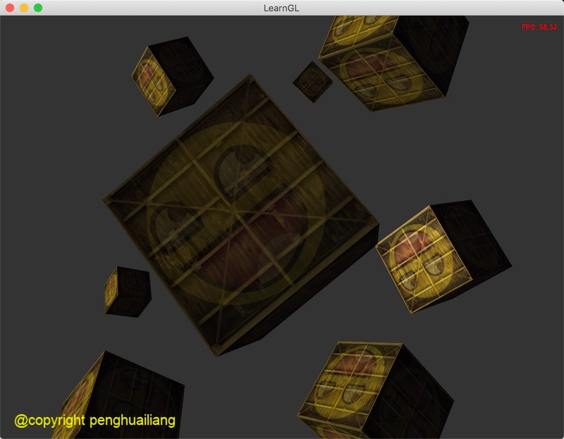
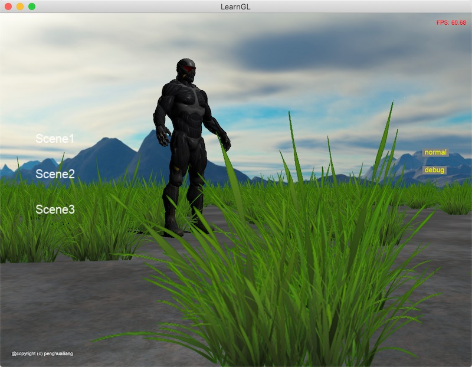
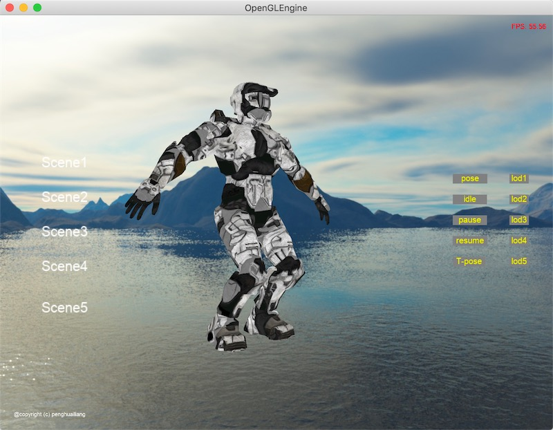
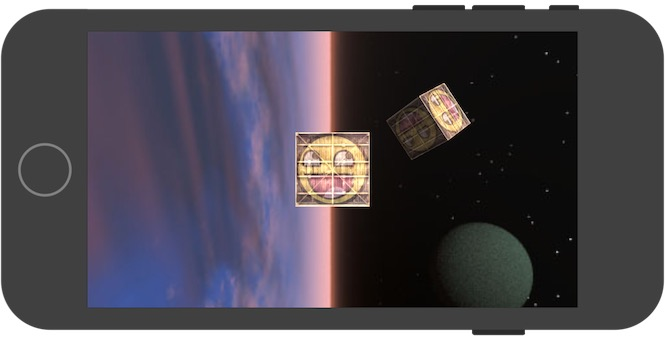
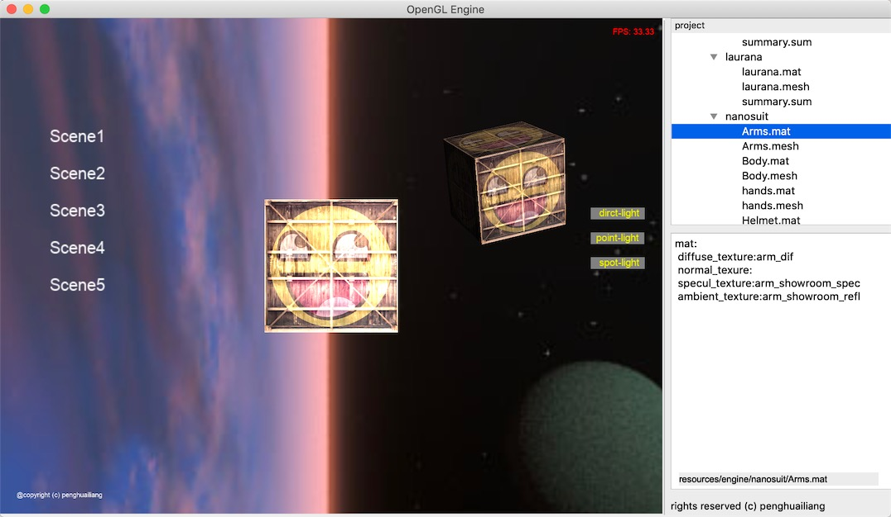

# 基于OpenGL实现的渲染引擎


# 依赖的库

*  [openGL][i4]
*  [openCV][i1]
*  [freetype][i2]
*  [glm][i3]
*  [glad][i5] -(not used on iOS)

## Tip

如果当前是打开的是qt/glfw工程，你需要在*engine.h*设置资源工作路径：

```c++
#define WORKDIR "/users/username/qt_engine"
```

在es工程(手机上)， 我们使用native的接口读取资源。


ios工程引用的资源全部是PVRTC压缩格式的纹理， 需要手动转换, 运行下面脚本即可生成对应的texture

``` sh
cd tools
sh texture.sh
sh ios_hash.sh
```

注意生成时间会比较长， 耐心等待


## Version

* qt 5.11
* opengl 330
* opengles 300
* freetype

# 特征


## 1. 光照系统

目前支持三种光照

- 聚光灯 

黑暗交替自然过渡， 且光照强度随着距离变远而衰减

<br> <br>
 
- 点光源

光照强度随着距离变远而衰减

<br> <br>

- 平行光

<br> <br>


## 2. 控制系统

- 实现 WASD 按键来前后左右移动相机

- 按住Space键绕前方定点旋转相机

- 按上下左右键来改变场景里的光的方向


## 3. GUI

<br> <br>


初步实现了显示TrueType字体

点击事件系统

ui可以画Label, Button

## 4. Shadow 阴影

<br> <br>

右下角即灯光空间的depth-buffer

## 5. 蒙皮动画 & LOD

<br> <br>


支持蒙皮动画，和高模低模LOD

## 6. 更多就不枚举了

比如使用GPU Instance 批量画草， geomotry Shader显示法线，变换帧缓存后处理， PBR、BRDF、 IBL 更多的功能等你去探索

后期会逐步扩展引擎， 比如AR模块、lua热更模块、编写更多的geomotry以便调试

# 语法

## 1. glsl中支持文件包含

默认的glsl羽凡是不支持#include的， 我们这里实现了预编译扩展的效果， 使用如下：

```c
#include "lib/brdf.glsl"
```

注意include的路径是相对于shader目录的路径，而不是当前shader所在的路径

## 2. 运行时切换宏

你可以在glsl使用#ifdef类似c的语法这样定义

```c++
#ifdef _CALLBACK__ 
for(int i=0;i<LIGHT_NUM;i++)
{
   [...]
}
#else
[...]
#endif
```

在c++中在shader运行时编译前，这样设置对glsl的宏

```cpp
Shader("model.vs","outline.fs",nullptr, Macro("_CALLBACK__","","LIGHT_NUM","4")
```

## 3. ES支持

对于和ES版本的转换， 你不必太关注更多的细节， 引擎在预编译shader的时候，会自动处理好如下：

* 浮点数精度问题

es浮点数默认是：precision mediump float;

* version声明

引擎实现移动版本会自动转化为 #version 300 es

* 压缩纹理支持

支持PVRTC 压缩纹理， 包含pvrtc4 & pcrtv2

<br> <br>


## 4.Debug支持

 如果shader报错，会显示对应的行号，你可以去temp目录查看预编译好的shader， 迅速定位到问题。

注意：	只有在DEBUG模式下， 才会生成预编译的shader， Release下为了效率是不生成预编译的shder的。


## 5. qt 编辑器

主要是qt是跨平台的， qt可以支持编写界面，用以扩展引擎编辑器，这里只是初步的实现。

<br> <br>

## 6. 工具

关于工具的使用， 参考:
[tools references](/tools/readme.md)


<br>
penghuailiang<br>
2019-05-10


[i1]: https://opencv.org
[i2]: https://www.freetype.org
[i3]: http://glm.g-truc.net
[i4]: http://www.opengl.org
[i5]: https://glad.dav1d.de
